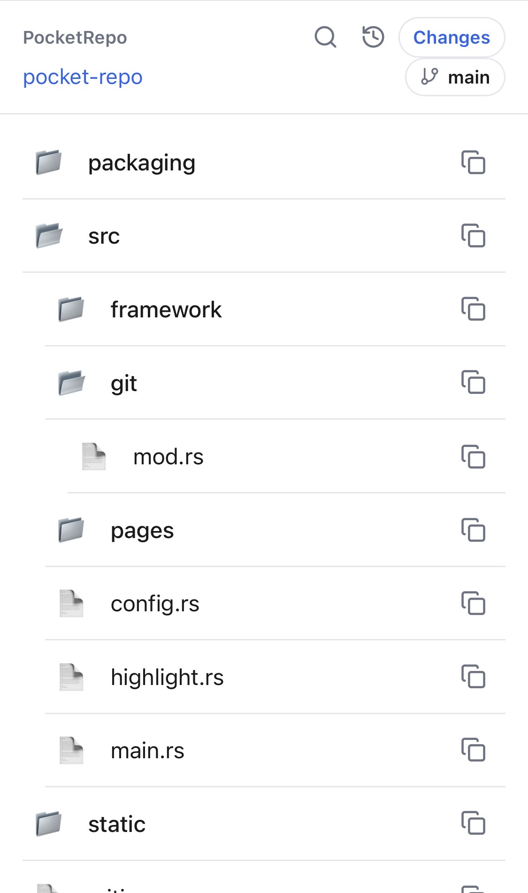
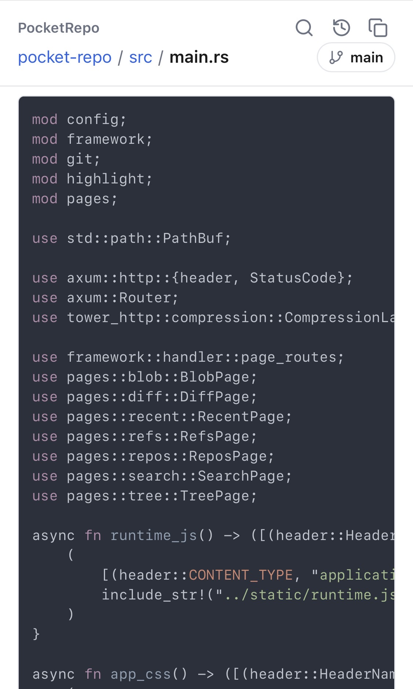
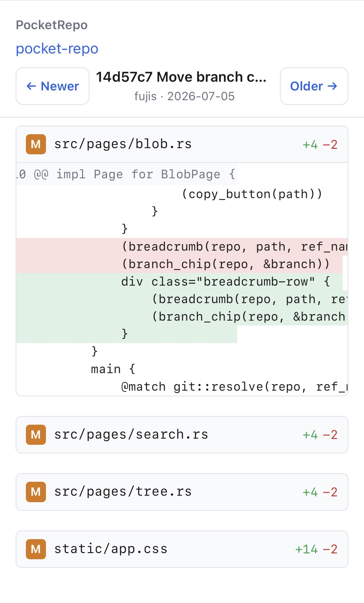

# PocketRepo

> A phone-friendly file viewer for Git repos.

PocketRepo runs a small web server on your dev machine (e.g. `http://localhost:3000`) so you can browse a repository's files comfortably from your phone's browser. It assumes your dev machine and phone can reach each other directly over a private VPN network, such as Tailscale.

## Screenshots

<p align="center">
  
  &nbsp;
  
  &nbsp;
  
</p>

<p align="center">
  <em>From left: directory tree / file view / Git diff</em>
</p>

## Getting started

### 1. Install

```sh
cargo install --path .   # -> ~/.cargo/bin/pocket-repo
```

### 2. Start the server on your dev machine

Choose which repositories to serve in `~/.config/pocket-repo/config.toml`:

```toml
port = 3000
scan_roots = ["~/ghq"]   # auto-discover git repos under these roots
```

Then run:

```sh
pocket-repo
```

For always-on (daemon) setup, see [PACKAGING.md](PACKAGING.md).

### 3. Access from your phone

Open the dev machine's Tailscale IP from your phone's browser:

```
http://<dev-machine-100.x.x.x>:3000
```

> Security: there is no authentication; the tailnet is the access boundary. To tighten it, bind to the Tailscale IP only, or use `127.0.0.1` + `tailscale serve`.

## License

MIT
