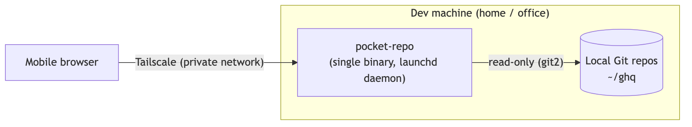

# PocketRepo

> A phone-friendly file viewer for Git repos.

Developers on the go often think "how was this implemented again?", "I want to reply to that review comment", or "I want to hand this file to Claude Code." Yet GitHub's web UI and typical file browsers aren't optimized for reading code on a phone.

PocketRepo runs as a lightweight server (a single binary) on your home or dev machine, and you reach it securely from your phone over a private network such as Tailscale.

## Screenshots

<p align="center">
  
  &nbsp;
  
  &nbsp;
  
</p>

<p align="center">
  <em>From left: directory tree / file view / Git diff</em>
</p>

## How it works

<p align="center">
  
</p>

The server runs on your dev machine and reads local Git repositories directly. Your phone reaches it over Tailscale — nothing is exposed to the public internet.

<!-- Diagram source: docs/architecture.mmd — regenerate with:
     npx -y @mermaid-js/mermaid-cli -i docs/architecture.mmd -o docs/architecture.png -b white -s 2 -->


## Goals

* A UI optimized for reading code on a phone
* Fast browsing of Git repositories
* Usable from a browser, no dedicated app required
* Easy to deploy as a single binary
* Safe to use within a private network

## Features

* **Multiple repositories** — auto-discover repos under `scan_roots` (e.g. a ghq layout), or list them explicitly
* **Directory tree** — tap the folder icon to expand/collapse in place; expansion state is remembered in the browser (directory names are still deep links)
* **File view with syntax highlighting** — highlighted server-side (syntect)
* **Fuzzy file search** — launch from any screen via the search icon (fzf-style scoring with nucleo)
* **Git diff** — a timeline from the uncommitted working tree → HEAD → back through history, with per-file collapsing
* **Branch / tag selection** — browse the tree, files, and search at any ref (shareable via `?ref=`)
* **Recently viewed files** — remembered per device (localStorage)
* **Copy path** — one tap to copy a repo-root-relative path from any entry
* **Response compression** — brotli / gzip / zstd, snappy even over a mobile link
* **Daemonization** — always-on with auto-restart via launchd (macOS)

## Getting started

### Build and install

```sh
cargo install --path .   # -> ~/.cargo/bin/pocket-repo
```

### Configuration

The default config file is `~/.config/pocket-repo/config.toml`:

```toml
bind = "0.0.0.0"        # default 0.0.0.0
port = 3000             # default 3000

# Auto-discover git repositories under these roots (ghq layout)
scan_roots = ["~/ghq"]

# Pin specific repos or override their display name
# [[repos]]
# path = "~/work/some-repo"
# name = "work-repo"
```

You can also pass repositories on the command line (added to the config):

```sh
pocket-repo ~/path/to/repo-a --port 8080
pocket-repo --help
```

### Run and access

```sh
pocket-repo
```

Open it from your phone on the same tailnet using the dev machine's Tailscale IP:

```
http://<dev-machine-100.x.x.x>:3000
```

For always-on (daemon) setup and Homebrew instructions, see [PACKAGING.md](PACKAGING.md).

> Security: there is no authentication; the tailnet is the access boundary. To tighten it, bind to the Tailscale IP only, or use `127.0.0.1` + `tailscale serve`.

## Tech stack

* **Language**: Rust (single binary, static assets embedded)
* **Server**: [axum](https://github.com/tokio-rs/axum) + [maud](https://maud.lambda.xyz/) (HTML templating)
* **UI framework**: [maudliver](https://github.com/ppdx999/maudliver), vendored — a stateless, server-driven UI (Elm Architecture over HTTP, ID-based HTML diffing)
* **Git**: [git2](https://github.com/rust-lang/git2-rs) (vendored libgit2, read-only)
* **Highlighting**: [syntect](https://github.com/trishume/syntect) (pure-Rust regex)
* **Fuzzy search**: [nucleo](https://github.com/helix-editor/nucleo)

Repository data is never stored in the Model; `view()` re-reads from git on each render. Only lightweight state (expanded paths, the selected ref) is kept, so even large repositories load lazily — just the parts you open.

## License

MIT
